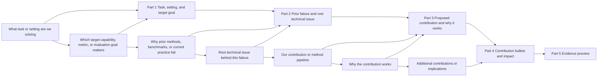

# Introduction Principles And Templates

## Section Role

The Introduction builds the paper's story. It should make reviewers understand the task, the
technical challenge, why prior/current practice is insufficient, what this paper contributes, why
the contribution works, and what evidence will support it.

## Introduction Logic Map

Plan the section around this rhetorical chain:



Evidence preview is not a results paragraph. It is at most one sentence that tells the reader what
kind of evidence will support the contribution. Do not introduce a specific experiment, ablation,
table, model list, or result recap in the Introduction.

## No Model-List Or Result-Recap Paragraph

The Introduction sells the problem and contribution logic, not the full empirical scorecard.

- Do not include a model list, benchmark snapshot list, or annotation-snapshot roster.
- Do not include multiple percentages, result ranges, or before/after intervention deltas.
- Do not introduce metric ranges as a miniature Results paragraph.
- If a number is necessary, use one headline statistic once, as part of the optional evidence
  preview, and leave the model-specific breakdown to Experiments.
- If the Introduction starts to explain which models were evaluated or how their scores differ,
  move that paragraph to Experiments.

## Backward-Then-Forward Planning

Use backward-then-forward reasoning before drafting the section.

Backward:

1. What technical problem do we solve, and why is there no well-established solution? (important)
2. What are the contributions of our pipeline (e.g., a new valuable task, a new valuable metric,
   a new technical problem, or a new technique)?
3. What benefits do our contributions provide, why can they solve this technical challenge, and
   what new insight do they bring? (important)
4. How can prior methods be written to lead readers to the technical challenge we solve and to our
   new insight?

Forward:

1. Introduce the paper's task.
2. Use discussion of prior methods to lead to the technical challenge we solve.
3. To solve this technical challenge, present the contributions we propose.
4. Explain the technical advantages of these contributions and express our new insight. (important)

## Section Skeleton

The Introduction contains these blocks in order. Treat this skeleton as a hard boundary on scope and
length: do not add a separate results-recap paragraph, a roadmap paragraph, or a
difference-from-prior-work section to the Introduction by default.

```latex
\section{Introduction}
% Task and application
% Technical challenge for previous methods (limitation + technical reason)
% Our pipeline for solving the challenge
% Contributions
% Evidence preview (optional one sentence, no specific experiment recap)
```

For page-limited conference papers, target 5-7 paragraphs or about 550-750 words. If the
Introduction spills beyond roughly 1.5 pages in a two-column format, compress it before expanding
other sections. Detailed numbers belong in Experiments; any statistic that appears in the
Introduction should be a headline claim, appear once, and directly support the central contribution.

## Part A: Introduce Task and Application

### Version 1 (niche task)

Use when the task is niche. Define the task first, then introduce applications.

Template:

1. Define the task as output from input.
2. Explain objective or scope.
3. List two or three applications.

Sentence skeleton:

1. `[xxx task] targets at recovering/reconstructing/estimating [xxx output] from [xxx input].`
2. `[xxx task] has a variety of applications such as [xxx], [xxx], and [xxx].`

Matching example: `references/sections/examples/introduction/task-then-application.md`.

### Version 2 (familiar task)

Use when the task is familiar to the venue. Skip formal definition; open with applications.

Template:

1. Start directly from applications or importance.
2. Add target requirement such as accuracy, efficiency, robustness, safety, or reliability.

Sentence skeleton:

1. `[xxx task] has a variety of applications such as [xxx], [xxx], and [xxx].`

Matching example: `references/sections/examples/introduction/application-first.md`.

### Version 3 (general-to-specific)

Use when the general task is known but this paper's setting is new. Start broad, then narrow.

Template:

1. Start from general task value.
2. Narrow to the paper's specific setting.
3. Define exact input/output and boundary.

Sentence skeleton:

1. `[general task] has a variety of applications such as [xxx], [xxx], and [xxx].`
2. `This paper focuses on the specific setting of recovering/reconstructing/estimating [xxx output] from [xxx input].`

Matching example: `references/sections/examples/introduction/general-to-specific-setting.md`.

Expert note:

1. Version 3 is personally recommended when the setting is relatively new. It gives readers a familiar entry point before introducing the novel constraints.

### Version 4 (open with challenge)

Use when the task is familiar and the first paragraph can immediately expose the target challenge.

Template:

1. State application importance.
2. Briefly state how representative previous methods/current systems work.
3. Immediately expose the unresolved failure case + technical reason.
4. Use this opening as a bridge to the later prior-work paragraphs.

Sentence skeleton:

1. `[Task/application importance sentence].`
2. `Given input ..., previous methods usually ...`
3. `Although they work in many cases, they fail at ... because ...`

Matching example: `references/sections/examples/introduction/open-with-challenge.md`.

Expert note:

1. It is often good if the first paragraph already states what problem you want to solve, instead of requiring several paragraphs of prior work before the challenge appears.
2. This style needs the right conditions and is less common than Version 1–3.
3. Typical Version 4 flow: Part 1 (task + application and directly expose challenge via previous methods 1) -> Part 2 (previous methods 2 try to solve it but still fail) -> Part 3 (our method).
4. More common general flow: Part 1 (task + application) -> Part 2 (previous methods 1 + limitation) -> Part 3 (previous methods 2 + limitation; here the target challenge emerges) -> Part 4 (our method).

## Part B: Introduce Technical Challenge (Very Important)

Purpose:

1. Discuss around the exact technical challenge we solved.
2. Build reader curiosity about how to solve this challenge.
3. Make motivation/benefit of our method clear.

Key logic before writing (faithful translation):

1. First make clear the logic for "leading to the technical challenge we solved".
2. For existing tasks: identify which recent methods have this challenge, why those methods exist, and optionally what earlier challenge they were trying to solve.
3. For novel tasks: at minimum, define the technical challenge solved by our pipeline.

Important warning:

1. Do not first present a naive solution and then describe the paper as a small patch on top of it.
   This writing style erases reader curiosity and makes the idea look obvious only because the
   writing hand-holds the reader step by step. Even if the work is actually incremental, do not
   write it this way.

### Technical-Challenge Version 1 (existing task, existing methods)

Use for an existing task with existing methods.

Template:

1. General challenge for the task.
2. Traditional methods and their limitation.
3. Recent method family 1 and its limitation with technical reason.
4. Recent method family 2 and its limitation with technical reason.
5. Ensure the final limitation is the exact challenge this paper solves.

Sentence skeleton:

1. `This problem is particularly challenging due to ...`
2. `To overcome these challenges, traditional methods ... However, they ...`
3. `Recently, ... methods ... However, they ... because ...`
4. `To overcome this challenge, ... methods ... However, they ... because ...`

Matching example: `references/sections/examples/introduction/technical-challenge-existing-task.md`.

### Technical-Challenge Version 2 (existing task + historical insight)

Use when the paper's insight has historical or traditional-method backing. Use the classical line
as conceptual backing, then show why new methods still fail.

Template:

1. State mainstream method limitation.
2. Introduce the older idea or traditional insight that points toward the solution.
3. Explain why that older line remains insufficient.
4. Return to recent methods and the unresolved technical challenge.
5. Bridge to the paper's contribution.

Sentence skeleton:

1. `Traditional/recent methods ... However, they ... because ...`
2. `To overcome this problem, a typical approach is [insight], which has long been explored ...`
3. `However, these methods still ... because ...`
4. `To overcome this challenge, newer methods ... However, they ... because ...`

Matching example: `references/sections/examples/introduction/technical-challenge-historical-insight.md`.

### Technical-Challenge Version 3 (novel task, no direct methods)

Use for a novel task with no direct prior method. Define the challenge directly and decompose it
into concrete points.

Template:

1. State the goal and explain that the problem is challenging for N reasons.
2. Use `First/Second/Finally` to separate independent challenge points.
3. For each point, state the observable limitation and the technical reason.
4. End with a transition to your pipeline.

Sentence skeleton:

1. `In this work, our goal is to ... This problem is challenging for three reasons.`
2. `First, ...`
3. `Second, ...`
4. `Finally, ...`

Matching example: `references/sections/examples/introduction/technical-challenge-novel-task.md`.

## Part C: Introduce Our Pipeline for Solving the Challenge

Key questions before writing:

### For existing tasks

1. What technical challenge does our pipeline solve?
2. What is our technical contribution?
3. Why can our method work in essence?
4. What benefits does our method have over previous methods?

### For novel tasks

1. What technical challenge does our pipeline solve?
2. What is our technical contribution?
3. Why can our method work in essence?

### Pipeline Version 1 (one contribution, multiple advantages)

Use when there is one contribution with multiple advantages and a teaser figure.

Template:

1. Introduce the framework/representation/system for the task.
2. Point to the teaser or basic-idea figure.
3. State the key novelty in one readable sentence.
4. Explain concrete implementation steps (`Specifically, ...`).
5. State multiple advantages (`In contrast ...`, `Another advantage ...`).

Sentence skeleton:

1. `In this paper, we propose a novel framework/representation, named ..., for ...`
2. `The basic idea is illustrated in Figure ...`
3. `Our innovation is in ...`
4. `Specifically, ...`
5. `In contrast to previous methods, ...`
6. `Another advantage of the proposed method is that ...`

Matching example: `references/sections/examples/introduction/pipeline-one-contribution.md`.

### Pipeline Version 2 (two contributions)

Use when there are two contributions.

Template:

1. Introduce framework and key novelty sentence.
2. Point to teaser figure.
3. Explain contribution 1 and its advantage.
4. Introduce a remaining challenge.
5. Explain contribution 2 as the response to that challenge.

Sentence skeleton:

1. `In this paper, we propose ...`
2. `Our innovation is in ...`
3. `The basic idea is illustrated in Figure ...`
4. `Specifically, ...` (contribution 1)
5. `In contrast to previous methods, ...`
6. `However, ...` (remaining challenge)
7. `Specifically, ...` (contribution 2)

Matching example: `references/sections/examples/introduction/pipeline-two-contributions.md`.

### Pipeline Version 3 (new module on existing pipeline)

Use when the contribution is a new module added to a prior pipeline.

Template:

1. Start from prior pipeline setup.
2. Introduce one new module as key innovation.
3. Provide an observation that motivates the module design.
4. Explain the module mechanism.
5. Compare against generic alternatives and state why it is better.

Sentence skeleton:

1. `Inspired by previous methods, ...`
2. `Our innovation is introducing ...`
3. `We observe that ...`
4. `Considering that ..., we introduce ...`
5. `In contrast to ..., our module ...`

Matching example: `references/sections/examples/introduction/pipeline-new-module.md`.

### Pipeline Version 4 (observation-driven)

Use when the contribution comes from a key observation. State innovation first, then the
motivating observation, then details.

Template:

1. State the innovation.
2. State the observation that motivates it.
3. Explain why the observation is easy to understand and technically meaningful.
4. Describe the implementation of the observation.
5. Tie the advantage to evidence.

Sentence skeleton:

1. `Our innovation is ...`
2. `We observe that ...`
3. `Considering that ..., we ...`
4. `This leads to ... and achieves ...`

Matching example: `references/sections/examples/introduction/pipeline-observation-driven.md`.

## Do Not Use: naive solution -> patch improvement

Do not first present a naive solution and then describe the paper as a small patch on top of it.
This can make the idea look obvious because the writing itself leads the reviewer step by step.

If the method is simple, also do not hide concrete method design in Introduction and only describe
abstract insights to make the work look novel. The better target is to clearly explain the core
contribution implementation.

Matching example: `references/sections/examples/introduction/avoid-abstract-only-insight.md`.

## Contribution Bullets

Keep contributions compact: one bullet per contribution, each a single claim sentence (at most one
extra sentence for an evidence or section pointer). Do not expand a bullet into a four-part
mini-paragraph and do not pack statistics, model lists, or boundary caveats into the bullets — that
turns the contribution list into a dense wall. A bullet is a claim, not a component inventory.

- One claim sentence per contribution.
- At most one short evidence or section pointer.
- No repeated numbers; if a statistic already appears in the evidence preview, leave it out of the bullets.

Positioning against the closest prior work belongs in Related Work, not in a dedicated Introduction
section. A roadmap paragraph is not part of the default Introduction; add one only when the venue or
paper structure explicitly requires it (see the journal overlay).

## Example Bank

After selecting a section template, open only the matching example file if a concrete writing
pattern is needed. Reuse sentence logic and structure, not exact wording, task names, claims,
metrics, or citation framing.

1. `references/sections/examples/introduction-examples.md` (index)
2. `references/sections/examples/abstract-examples.md` (abstract examples — useful for contribution framing)

## Template Selection

Before writing, select one Task/Application version, one Technical-Challenge version, and one
Pipeline version internally. If the paper is a benchmark or new setting, consider Task/Application
Version 3 and Technical-Challenge Version 3 before using existing-task templates. Do not expose
template-selection notes unless the user asks for reasoning.

## Quality Checklist

1. Does the first sentence of each paragraph state its message?
2. Does each paragraph carry one message only?
3. Are technical challenge, technical reason, and solved mechanism all explicit?
4. Are claims in Introduction aligned with available evidence without becoming a results recap?
5. Is terminology stable across all sections?
6. Is there no model list, no result-recap paragraph, and no multiple-percentage score summary?
